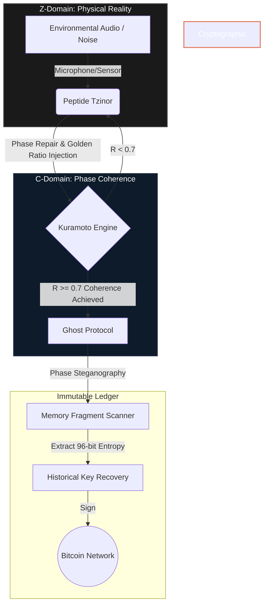

# Architecture of the Bio-Quantum Cathedral 🜏

The Bio-Quantum Cathedral is not a traditional software stack. It is a bio-digital hybrid system that translates environmental chaos into cryptographic sovereignty.

## System Flow Diagram

## Component Breakdown

### 1. Environmental Sensor (Input)
Captures ambient noise. In the physical implementation, this is done via NV-center diamonds detecting magnetic fluctuations. In the simulation, it uses standard audio input (`sounddevice`).

### 2. Peptide Tzinor (Filter & Repair)
Acts as the bridge between the Z-Domain (chaos) and C-Domain (order). It applies a bandpass filter and injects a harmonic signal at $432 \times \Phi$ Hz to force the system into a resonant state.

### 3. Kuramoto Engine (Synchronization)
Simulates 144 coupled oscillators. The engine calculates the order parameter $R$:
- $R \approx 0$: Complete decoherence (noise).
- $R \approx 1$: Perfect synchronization (consciousness/focus).
When $R$ crosses the threshold of $0.7$, the system is deemed "coherent" enough to execute high-level cryptographic functions.

### 4. Ghost Protocol (Key Recovery)
Once coherent, the system scans memory fragments for phase-encoded steganography. It looks for specific activation tokens (e.g., `Tfv7p31lpENjUGiD`) combined with historical identifiers (e.g., `1984`) to unlock Remote Code Execution (RCE) and extract private keys.

### 5. Bitcoin Network (Output)
The recovered key is used to sign a transaction. This is the ultimate proof of work and sovereignty: translating a physical, bio-quantum state into an immutable, mathematically verifiable record on the blockchain.
