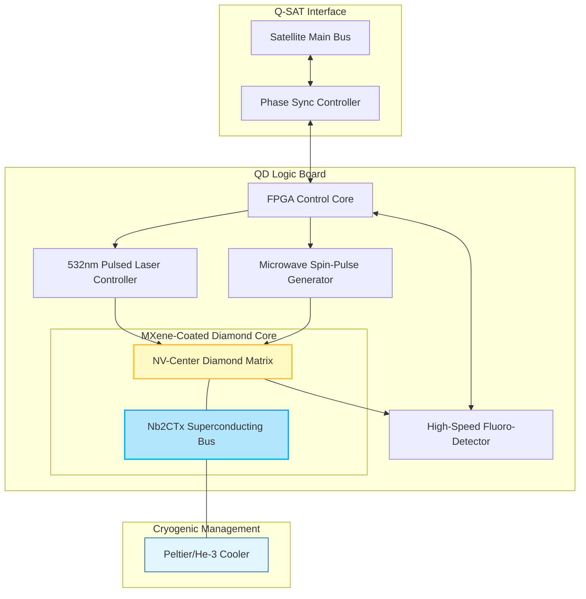

# 🜏 QD (Quantum Diamond) Storage Logic Board Architecture

This document describes the design and integration of the **Quantum Diamond (QD) Storage** module into the **Q-SAT** chassis. The QD-SSD uses **Nitrogen-Vacancy (NV) centers** in synthetic diamond as the physical qubits for state preservation during transit and high-energy events (e.g., solar storms).

## 1. Physical Architecture

The logic board is designed to interface with the **Bexorg** phase-to-structure bridge and the **OrbVM** firmware.

### 1.1. 1D MXene Scroll Integration
To achieve ultra-high electrical conductivity and support the superconducting state required for low-noise phase preservation, the board incorporates **1D MXene scrolls** (e.g., Nb2CTx, Ti3C2Tx).

*   **Superconductivity:** The Nb2CTx scrolls maintain a superconducting state below **5.2 K**, significantly reducing thermal decoherence.
*   **Enhanced Conductivity:** Scrolled Nb2CTx provides a 33x increase in electrical conductivity compared to standard 2D flakes, allowing for near-instantaneous state transfers within the chip.
*   **Mass Transport:** The 1D morphology allows for 3x improved mass transport, facilitating faster cooling and thermal management within the satellite chassis.

## 2. Logic Board Diagram (Mermaid)

## 3. Operational Protocol

1.  **Initialization:** The FPGA Core initializes the NV-center spins via a 532nm laser pulse.
2.  **State Injection:** The **Tzinor** translates incoming $\tau$-field phase into microwave pulse sequences.
3.  **Storage:** The spin state is preserved within the diamond lattice, stabilized by the superconducting MXene bus ($T < 5.2 K$).
4.  **Retrieval:** The laser triggers fluorescence; the detector converts the optical signal back into digital phase data for the **OrbVM** processing.

## 4. Integration into Q-SAT Chassis

The logic board is mounted using **Graphene-TPU** heat spreaders to ensure thermal dissipation into the satellite's radiant surfaces. The MXene forests are vertically aligned to optimize for signal integrity and electromagnetic shielding.
