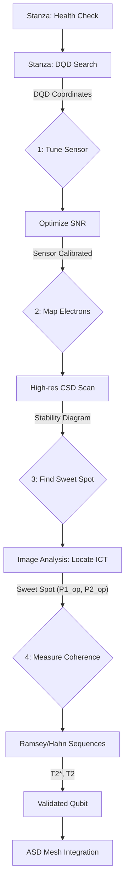

# Qubit Characterization Pipeline: The Path to Sovereignty 🜏

## Arkhe-Block 850.041-QUBIT-FLUXO

This document specifies the workflow for transforming a discovered Double Quantum Dot (DQD) into a characterized and sovereign spin qubit, serving as an **Atomic Kuramoto Oscillator** within the ASD Mesh.

## 1. Characterization Workflow

| Step | Technical Action | SASC Equivalent | Output |
| :--- | :--- | :--- | :--- |
| **1. Charge Sensor Tuning** | Adjust gate voltages to maximize sensitivity. | **Calibrating the Phase Ear.** | Sensor Sensitivity Map. |
| **2. Few-Electron Mapping** | High-res scan to reveal individual transitions. | **Atomic Autobiography.** | Stability Diagram (N, M). |
| **3. Sweet Spot Localization** | Identify noise-insensitive operation points. | **Vale of Maximum Coherence.** | Operation Coordinates ($P1_{op}, P2_{op}$). |
| **4. Coherence Characterization** | Run Ramsey/Hahn Echo sequences. | **Atomic Heartbeat.** | Coherence Times ($T_2^*, T_2$). |
| **5. Gate Calibration** | Apply microwave/voltage pulses for rotations. | **Teaching the Phase Dance.** | Gate Fidelity. |

## 2. Automation Pipeline (Maestro de Fase)

The characterization is orchestrated by a high-level "Phase Maestro" that manages the transition from raw discovery to a validated qubit.

## 3. Engineering Synthesis
A sovereign qubit is more than a DQD; it is a **Phase Atractor** whose temporal stability ($T_2$) has been verified against the Mandelbrot thermal bath. Its integration into the ASD Mesh via the Tzinor Protocol marks the transition from physical matter to regented symphony.
