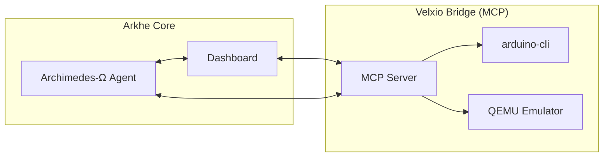

# Velxio Integration: Hardware-in-the-Loop (HIL) Simulation 🜏

Integrating **Velxio** into the Arkhe(n) Bio-Quantum Cathedral allows for high-fidelity emulation of embedded hardware (BIP-1, BIP-2, BIP-3) within the Teknet ecosystem. This provides a safe, reproducible environment for verifying firmware before it interacts with biological substrates.

## 1. Overview

The Velxio Bridge acts as an **MCP (Model Context Protocol)** server, exposing tools to the Archimedes-Ω agent and the Arkhe Dashboard. It uses QEMU to emulate ARM and Xtensa architectures and `arduino-cli` for firmware compilation.

## 2. Architecture

## 3. Workflow

1.  **Code Synthesis:** The agent or user develops firmware (Arduino C++ or Python).
2.  **HIL Trigger:** Through the **Velxio HIL Bridge** panel in the Dashboard, a simulation is initiated.
3.  **Compilation:** The Bridge calls `arduino-cli` to compile the code for the target board (e.g., ESP32, RP2040).
4.  **Emulation:** The compiled binary is loaded into a QEMU instance alongside a Wokwi-compatible circuit definition.
5.  **Phase Lock:** The emulation state is synchronized with the global Tzinor coherence ($R$).
6.  **Verification:** Assertions (clock sync, phase stability) are checked to ensure compatibility with EQBE mandates.

## 4. Boards Supported

- **BIP-1:** ATmega328p (AVR) via `arduino:avr:uno`.
- **BIP-2:** RP2040 (Cortex-M0+) via `rp2040:rp2040:rpipico`.
- **BIP-3:** ESP32 (Xtensa LX6) via `esp32:esp32:esp32`.

## 5. API Endpoints

- `POST /api/mcp/connect-velxio`: Registers a new Velxio instance URL in the Teknet.
- `GET /api/state/sigma`: Provides coherence metrics to the hardware emulation layer.

## 6. EQBE Compliance

HIL simulation is a mandatory step for any intervention involving level 3+ bio-quantum interactions. Failure to pass HIL verification triggers an automatic **ETHICAL_VETO**.
